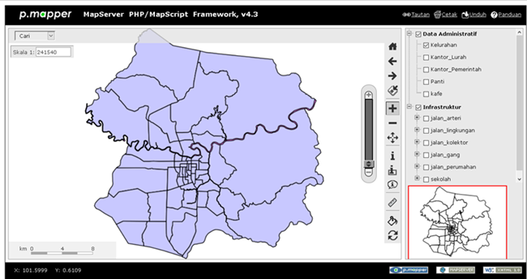

# pmapper-pekanbaru-ms4w

This repository is a [p-mapper](http://sourceforge.net/projects/pmapper/), specially tailored for 
City of Pekanbaru, Riau Province, Indonesia.

GIS for Pekanbaru, based on p-mapper

# Installing
[Download](https://github.com/kampar/pmapper-pekanbaru-ms4w/archive/master.zip) or [clone](github-windows://openRepo/https://github.com/kampar/pmapper-pekanbaru-ms4w) this repo into your [MS4W](http://maptools.org/ms4w/)
